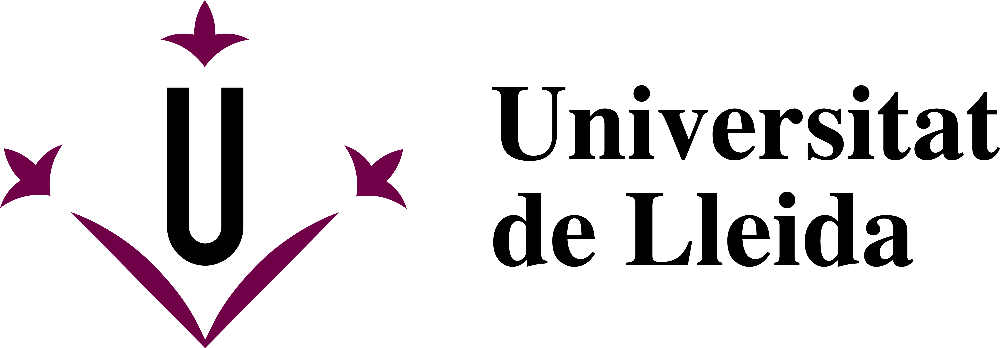

<link rel="stylesheet" type="text/css" href="styles/custom.css">
<center><h3><span class="sshowtitle">Apache Spark Basics</span></h3></center>
<p> </p>
<p> </p>
<center><span style="color:blue; font-family:Georgia;  font-size:1em;">Ramon Béjar</span></center>
<canvas id="myCanvas" width="200" height="100" style="border:0px solid">
    </canvas>
<center>Data mining - Master on Computer Science</center>

<center></center>

---

## 1 - Using Apache Spark
Spark applications run as independent sets of processes on a cluster, coordinated by the **SparkContext object** in your main program (called the driver program).


SparkContext allocates resources from the cluster across applications. Datasets are distributed in different partitions across the memory of nodes in the cluster.


Once connected, Spark acquires executors on nodes in the cluster, which are processes that run computations and store data for your application. 

Next, it sends your application code (defined by JAR or Python files passed to SparkContext) to the executors. 

Finally, SparkContext sends tasks to the executors to run.

---

## Spark driver entry point: spark context


```python
import pyspark
```


```python
sc =  pyspark.SparkContext('local[*]')
sc
```


<div>
    <p><b>SparkContext</b></p>

    <p><a href="http://192.168.1.170:4040">Spark UI</a></p>

    <dl>
      <dt>Version</dt>
        <dd><code>v3.0.0</code></dd>
      <dt>Master</dt>
        <dd><code>local[*]</code></dd>
      <dt>AppName</dt>
        <dd><code>pyspark-shell</code></dd>
    </dl>
</div>


---
## Driver for working with data frames

For some spark functions related to SQL like queries and data frames (RDDs with a structure of columns with types) with our data (but executed by the spark driver), we need to create a special context, called **Spark Session**, but linked to our main spark context. We use this Spark Session when we work with **spark data frames**.


```python
sqlCtx = pyspark.sql.SparkSession(sc)
sqlCtx
```


    <div>
        <p><b>SparkSession - in-memory</b></p>

<div>
    <p><b>SparkContext</b></p>

    <p><a href="http://192.168.1.170:4040">Spark UI</a></p>

    <dl>
      <dt>Version</dt>
        <dd><code>v3.0.0</code></dd>
      <dt>Master</dt>
        <dd><code>local[*]</code></dd>
      <dt>AppName</dt>
        <dd><code>pyspark-shell</code></dd>
    </dl>
</div>

    </div>


---
## Main Spark Concepts

### Partitions
Spark’s basic abstraction is the **Resilient Distributed Dataset, or RDD**. An RDD represents a data set that is fragmented in different partitions, where different partitions can be in different nodes of the cluster.

That fragmentation is what enables Spark to execute in parallel, and the level of fragmentation is a function of the number of **partitions** of your RDD.  

### Caching

"Spark handles all data in memory" (all the data that it can fit). 

This is tricky and here's where the magic relies. Most of the time you will be working with metadata not with all the data, and computations are only left for the time that you need the results.

Storing that results or leaving them to compute them again has a high impact in response times. When you store the results, it is said to be **catching the RDD**.


 
---
### Shuffling

There are many different tasks that require **shuffling** of the data across the cluster:
- Finding the distinct elements of a RDD
- Sorting the elements of the RDD
- A table join (to join two tables on the field “id”)
- A cartesian product of two RDDs


Of course, the **holy grail** of a map/reduce algorithm is to have as many as possible tasks with no shuffling (or low shuffling), meaning that the computations performed on each element will be totally independent on others (or depending only on some constant number of other elements) 
$$ \Rightarrow \textrm{linear time computations} : O(n) $$

There are some tasks that it has been proven that it is impossible to perform in linear time, like sorting, where a $O(n\log n) \ \ \ \ \ \ $lower bound on the total number of comparisons in any sorting algorithm is known. If you are curious, check the paper:

["Lower bounds for sorting networks"](https://www.researchgate.net/publication/221590742_Lower_bounds_for_sorting_networks/link/0912f5108456ceb10d000000/download)

## 2 - RDD Basics

An RDD can be defined as a distributed collection of elements. All work done with Spark can be summarized as **creating**, **transforming** and **applying** operations over RDDs to compute a result. Under the hood, Spark automatically **distributes the data contained in RDDs** across your cluster and **parallelizes the operations** you perform on them.

RDD properties:
* it is an **immutable distributed** collection of objects
* it is split into multiple **partitions**
* it is computed on different nodes of the cluster
* it can contain any type of Python object (user defined ones included)

An RDD can be created in **two ways**:
1. Distributing either an external dataset or a collection of objects in the driver program
2. Transforming one RDD (or many) to get a new one

---
## Basic RDD transformation examples


```python
# loading an external dataset
lines = sc.textFile("data/people.csv")
print (lines, type(lines))
```

    data/people.csv MapPartitionsRDD[137] at textFile at NativeMethodAccessorImpl.java:0 <class 'pyspark.rdd.RDD'>


Spark's API allows passing functions to its operators to run them on the cluster. For example, we could extend our example by filtering the lines in the file that contain a word, such as individuum.


```python

# applying a transformation to an existing RDD
filtered_lines = lines.filter(lambda line: "individuum" in line)
print (type(filtered_lines), " : ", filtered_lines)
```

    <class 'pyspark.rdd.PipelinedRDD'>  :  PythonRDD[138] at RDD at PythonRDD.scala:53


Observe that the RDD object represents an abstraction to the whole data set, but the object in the driver program **does not** contain the actual data. 

It is important to note that once we have an RDD, we can run **two kind of operations**:
* **transformations**: construct a new RDD from a previous one. For example, by filtering lines RDD we create a new RDD that holds the lines that contain "individuum" string. Note that the returning result is an RDD.
* **actions**: *compute* a result based on an RDD, and returns the result to the driver program or stores it to an external storage system (e.g. HDFS). Note that the returning result is not an RDD but another kind of variable.

To get back to the driver some of the data from an RDD, we need to execute some kind of actions. Transformations are defined in a **lazy** manner, so they are only computed **once the results are demanded by an action**.


```python
action_result = lines.first()
print (action_result, " type: ", type(action_result))
action_result
```

    ,Age[years],Sex,Weight[kg],Eye Color,Body Temperature[C]  type:  <class 'str'>


    ',Age[years],Sex,Weight[kg],Eye Color,Body Temperature[C]'


```python
# filtered_lines is not computed until the next action is applied over it
filtered_lines.first()
```


    'individuum 1, 42, female, 52.9, brown, 36.9'


---
## Persistance of an RDD
If you want to perform more than one action with a given RDD, you can *force* to keep that RDD in memory once it has been created the first time, using the persist() function on the RDD. 


```python
import time

lines = sc.textFile("data/REFERENCE/*")
lines_nonempty = lines.filter( lambda x: len(x) > 0 )
words = lines_nonempty.flatMap(lambda x: x.split())
words_persisted = lines_nonempty.flatMap(lambda x: x.split())
```

* filter applies the lambda function to each line in lines RDD, only lines that satisfy the condition (that the length is greater than zero) are in lines_nonempty variable (**this RDD is not computed yet!**)
* flatMap applies the lambda function to each element of the RDD and then the result is flattened (i.e. a list of lists would be converted to a simple list)

Using an action with RDD words two times, with no explicit persistance:


```python
t1 = time.time()
words.count()
print ("Word count 1 time:",time.time() - t1)

t1 = time.time()
words.count()
print ("Word count 2 time:",time.time() - t1)
```

    Word count 1 time: 3.7476725578308105
    Word count 2 time: 3.6525588035583496


Using an action with RDD words two times, with explicit persistance:


```python
words_persisted.persist()
t1 = time.time()
words_persisted.count()
print ("Word count persisted 1:",time.time() - t1)

t1 = time.time()
words_persisted.count()
print ("Word count persisted 2:", time.time() - t1)

```

    Word count persisted 1: 4.623121500015259
    Word count persisted 2: 1.1735703945159912


**Actions** are operations that return an object to the driver program or write to external storage, they kick a computation. *Examples:* first, count.

Actions **force the evaluation** of the transformations required for the **RDD** they were called on, since they need to actually produce output.

Other examples of actions:
- take(num of elements)
- collect() -> to get the WHOLE data set !


```python
lines = sc.textFile("data/people.csv")
print ("Three elements", lines.take(3))
for l in  lines.collect():
    print(l)
```

    Three elements [',Age[years],Sex,Weight[kg],Eye Color,Body Temperature[C]', 'individuum 1, 42, female, 52.9, brown, 36.9', 'individuum 2, 37, male, 87.0, green, 36.3']
    ,Age[years],Sex,Weight[kg],Eye Color,Body Temperature[C]
    individuum 1, 42, female, 52.9, brown, 36.9
    individuum 2, 37, male, 87.0, green, 36.3
    individuum 3, 29, male, 82.1, blue, 36.4
    individuum 4, 61, female, 62.5, blue, 36.7
    individuum 5, 77, female, 55.5, gray, 36.6
    individuum 6, 33, male, 95.2, green, 36.5
    individuum 7, 32, female, 81.8, brown, 37.0
    individuum 8, 45, male, 78.9, brown, 36.3
    individuum 9, 18, male, 83.4, green, 36.6
    individuum 10, 19, male, 84.7, gray, 36.1

---
## 3 - Passing functions to Spark

Most of Spark’s transformations, and some of its actions, depend on passing in functions that are used by Spark to compute data.

In Python, we have three options for passing functions into Spark.

 *   For shorter functions, we can pass in lambda expressions
 *   We can pass in top-level functions, or
 *   Locally defined functions (that are evaluated within the scope of other functions)


```python
lines = sc.textFile("data/people.csv")

first_cells = lines.map( lambda line : line.split(",")[0])
print (first_cells.collect())

def getFirstC(line):
    return  line.split(",")[0]

print ( lines.map(getFirstC).collect() )
```

    ['', 'individuum 1', 'individuum 2', 'individuum 3', 'individuum 4', 'individuum 5', 'individuum 6', 'individuum 7', 'individuum 8', 'individuum 9', 'individuum 10']
    ['', 'individuum 1', 'individuum 2', 'individuum 3', 'individuum 4', 'individuum 5', 'individuum 6', 'individuum 7', 'individuum 8', 'individuum 9', 'individuum 10']


If we want to have functions that work with different columns, we have to produce different "instances" of a same lambda function pattern


```python
listofrdds = []

# This can be done with this function, that returns a specific version of
# a lambda function expression with a private copy of i
def f(i):
    return lambda x : x.split(",")[i]
    
for i in range(3):    
    # create the spark transformation with functions linked to
    # different values of i
    listofrdds.append( lines.map( f(i) ) ) 
    
for j in range(3):
    print (listofrdds[j].collect())

```

    ['', 'individuum 1', 'individuum 2', 'individuum 3', 'individuum 4', 'individuum 5', 'individuum 6', 'individuum 7', 'individuum 8', 'individuum 9', 'individuum 10']
    ['Age[years]', ' 42', ' 37', ' 29', ' 61', ' 77', ' 33', ' 32', ' 45', ' 18', ' 19']
    ['Sex', ' female', ' male', ' male', ' female', ' female', ' male', ' female', ' male', ' male', ' male']

---
## 4 - Working with common Spark transformations
Very common transformations you will likely be using are map() and filter():

- The map() transformation takes in a function and applies it to each element in the RDD with the result of the function being the new value of each element in the resulting RDD.
- An important variation of this function is mapPartitions(func), that is similar to map, but runs separately on each partition (block) of the RDD, so func must be of type Iterator_T => Iterator_U when running on an RDD of type T.
- The filter() transformation takes in a function and returns an RDD that only has elements that pass the filter() function (a funtion that returns True/False).

A specific class of RDD is the class of RDDs where the elements are (key,value) pairs. They are used as a kind of basic distributed "dictionary", that is very useful to implement many algorithms


```python
# Counting odd and even numbers
rddNumbers = sc.parallelize( [1,2,3,4,5,6,7,8,9,10])
rddEvenOdd = rddNumbers.map( lambda x : (x % 2,1) )
# Now, every odd number is mapped to (1,1) and every even one to (0,1)
print(rddEvenOdd.collect())
countHowMany = rddEvenOdd.reduceByKey( lambda x,y : x+y )
# Change keys to more "human" redeable ones
countHowMany.map( lambda x : ('even numbers:',x[1]) if not x[0] else ('odd numbers:',x[1]) ).collect()
```

    [(1, 1), (0, 1), (1, 1), (0, 1), (1, 1), (0, 1), (1, 1), (0, 1), (1, 1), (0, 1)]


    [('even numbers:', 5), ('odd numbers:', 5)]


Working with more than one RDD at the same time, we can implement even more powerful algorithms. Imagine an RDD with pairs of kind (personA,personB) whith the meaning "personA" would like to meet with "personB". How can we produce a list of all pairs (A,B) such that A wants to meet with B and vice versa?


```python
rddPersonLikes = sc.parallelize( [('a','b'), ('a','c') , ('b','a'), ('c','a') ] )
rddAllPairs = rddPersonLikes.cartesian(rddPersonLikes)
rddAllPairs.collect()
```


    [(('a', 'b'), ('a', 'b')),
     (('a', 'b'), ('a', 'c')),
     (('a', 'b'), ('b', 'a')),
     (('a', 'b'), ('c', 'a')),
     (('a', 'c'), ('a', 'b')),
     (('a', 'c'), ('a', 'c')),
     (('a', 'c'), ('b', 'a')),
     (('a', 'c'), ('c', 'a')),
     (('b', 'a'), ('a', 'b')),
     (('b', 'a'), ('a', 'c')),
     (('b', 'a'), ('b', 'a')),
     (('b', 'a'), ('c', 'a')),
     (('c', 'a'), ('a', 'b')),
     (('c', 'a'), ('a', 'c')),
     (('c', 'a'), ('b', 'a')),
     (('c', 'a'), ('c', 'a'))]


```python
matchedRDD = rddAllPairs.filter( lambda x : x[0][0] == x[1][1] and x[0][1] == x[1][0]  )
matchedRDD.collect()
```


    [(('a', 'b'), ('b', 'a')),
     (('a', 'c'), ('c', 'a')),
     (('b', 'a'), ('a', 'b')),
     (('c', 'a'), ('a', 'c'))]


But observe that every pair of matched people appears two times in the final filtered dataset. Can you fix this? Can you *feel* the shuffling in the cartesian transformation?

Another useful transformation, that also works with two (key,value) RDDs , is the join transformation. For every (key,Val1) in the left RDD and (key,Val2) in the right RDD, it produces the pair (key,(Val1,Val2)) in the resulting RDD:


```python
rddNetFlix = sc.parallelize( [('john',['A','B']),('Ana',['B','C'])] )
rddPrimeVideo = sc.parallelize( [('john',['J','H']),('Ana',['P','Q'])] )
joinByKeyRDD = rddNetFlix.join( rddPrimeVideo )
joinByKeyRDD.collect()
```


    [('john', (['A', 'B'], ['J', 'H'])), ('Ana', (['B', 'C'], ['P', 'Q']))]


Observe that we get only one element per person, because each person appears only once in every input RDD.

But if there are elements with the same key in some of the RDDs, observe what happens:


```python
rddNetFlix = sc.parallelize( [('john',['A','B']),('Ana',['B','C'])] )
rddPrimeVideo = sc.parallelize( [('john',['J','H']),('Ana',['P','Q']),('Ana',['R','S'])] )
joinByKeyRDD = rddNetFlix.join( rddPrimeVideo )
joinByKeyRDD.collect()
```


    [('john', (['A', 'B'], ['J', 'H'])),
     ('Ana', (['B', 'C'], ['P', 'Q'])),
     ('Ana', (['B', 'C'], ['R', 'S']))]


Yes, but if this is not what we desire, it can be fixed using aggregation!

---
## 5 - Working with spark dataframes

For working with some structure in the datasets, we can use spark dataframes, and now each element is a record with a same set of columns, where each column will have a type:


```python
# Remember:  sqlCtx = pyspark.sql.SparkSession(sc)
peopleDF = sqlCtx.read.json('data/people-binfo.json')
peopleHobbiesDF = sqlCtx.read.json('data/people-hobbies.json')
```


```python
peopleDF.printSchema()
peopleHobbiesDF.printSchema()
```

    root
     |-- age: long (nullable = true)
     |-- gender: string (nullable = true)
     |-- name: string (nullable = true)
    
    root
     |-- hobbies: array (nullable = true)
     |    |-- element: long (containsNull = true)
     |-- name: string (nullable = true)
    


There are other ways to make dataframes. Like for example, from a csv file.


```python
countriesDF = sqlCtx.read.option("header", "true").option("delimiter", ";").csv('data/countries_data.csv')
countriesDF.printSchema()
```

    root
     |-- Country (en): string (nullable = true)
     |-- Country (de): string (nullable = true)
     |-- Country (local): string (nullable = true)
     |-- Country code: string (nullable = true)
     |-- Continent: string (nullable = true)
     |-- Capital: string (nullable = true)
     |-- Population: string (nullable = true)
     |-- Area: string (nullable = true)
     |-- Coastline: string (nullable = true)
     |-- Government form: string (nullable = true)
     |-- Currency: string (nullable = true)
     |-- Currency code: string (nullable = true)
     |-- Dialing prefix: string (nullable = true)
     |-- Birthrate: string (nullable = true)
     |-- Deathrate: string (nullable = true)
     |-- Life expectancy: string (nullable = true)
     |-- Url: string (nullable = true)
    


We can always get a transformed version of a dataframe, where we change the type for some columns:


```python
from pyspark.sql.types import FloatType
from pyspark.sql import functions as SQLF
countriesDF = countriesDF.withColumn("Birthrate",SQLF.col("Birthrate").cast(FloatType()))
countriesDF.printSchema()
countriesDF.take(2)[1]
```

    root
     |-- Country (en): string (nullable = true)
     |-- Country (de): string (nullable = true)
     |-- Country (local): string (nullable = true)
     |-- Country code: string (nullable = true)
     |-- Continent: string (nullable = true)
     |-- Capital: string (nullable = true)
     |-- Population: string (nullable = true)
     |-- Area: string (nullable = true)
     |-- Coastline: string (nullable = true)
     |-- Government form: string (nullable = true)
     |-- Currency: string (nullable = true)
     |-- Currency code: string (nullable = true)
     |-- Dialing prefix: string (nullable = true)
     |-- Birthrate: float (nullable = true)
     |-- Deathrate: string (nullable = true)
     |-- Life expectancy: string (nullable = true)
     |-- Url: string (nullable = true)
    


    Row(Country (en)='Egypt', Country (de)='Ägypten', Country (local)='Misr', Country code='EG', Continent='Africa', Capital=None, Population='88487396', Area='1001450', Coastline='2450', Government form='republic', Currency='Pfund', Currency code='EGP', Dialing prefix='20', Birthrate=22.899999618530273, Deathrate='4.8', Life expectancy='73.7', Url='https://www.laenderdaten.info/Afrika/Aegypten/index.php')


We can show on the driver program the WHOLE dataframe with show():


```python
peopleDF.show()
peopleHobbiesDF.show()
```

    +---+------+-------+
    |age|gender|   name|
    +---+------+-------+
    | 47|     M|Michael|
    | 30|     M|   Andy|
    | 19|     F|  Jenny|
    +---+------+-------+
    
    +----------------+-------+
    |         hobbies|   name|
    +----------------+-------+
    |    [4, 5, 6, 7]|Michael|
    |[4, 5, 8, 7, 10]|   Andy|
    |[4, 5, 6, 7, 10]|  Jenny|
    +----------------+-------+
    


Suppose we want to join the info of each person with his set of hobbies. We can do this with the join function, indicating that the column to be used for joining two rows is the "name" column:


```python
joined = peopleDF.join(peopleHobbiesDF, [ "name" ])
joined.show()
joined.printSchema()
```

    +-------+---+------+----------------+
    |   name|age|gender|         hobbies|
    +-------+---+------+----------------+
    |Michael| 47|     M|    [4, 5, 6, 7]|
    |   Andy| 30|     M|[4, 5, 8, 7, 10]|
    |  Jenny| 19|     F|[4, 5, 6, 7, 10]|
    +-------+---+------+----------------+
    
    root
     |-- name: string (nullable = true)
     |-- age: long (nullable = true)
     |-- gender: string (nullable = true)
     |-- hobbies: array (nullable = true)
     |    |-- element: long (containsNull = true)
    


Now suppose we have a list of *target* (interesting) hobbies on an another dataframe


```python
dfTHobbies =  sqlCtx.read.json('data/target-hobbies.json')
dfTHobbies.show()
```

    +-------+
    |thobbie|
    +-------+
    |      4|
    |      8|
    |     10|
    +-------+
    


 And we would like to filter the hobbies of our people data frame with this list. We can use again a join operation, but now using as filtering predicate a spark sql function: array_contains(array,element)


```python
from pyspark.sql.functions import array_contains
filtered = joined.join(dfTHobbies, array_contains(joined.hobbies,dfTHobbies.thobbie) )
filtered.show()
```

    +-------+---+------+----------------+-------+
    |   name|age|gender|         hobbies|thobbie|
    +-------+---+------+----------------+-------+
    |Michael| 47|     M|    [4, 5, 6, 7]|      4|
    |   Andy| 30|     M|[4, 5, 8, 7, 10]|      4|
    |   Andy| 30|     M|[4, 5, 8, 7, 10]|      8|
    |   Andy| 30|     M|[4, 5, 8, 7, 10]|     10|
    |  Jenny| 19|     F|[4, 5, 6, 7, 10]|      4|
    |  Jenny| 19|     F|[4, 5, 6, 7, 10]|     10|
    +-------+---+------+----------------+-------+
    


Well, this is almost what we wanted, except that the record for a same person appears repeated, once per every target hobby he has in his list. Ok, but this can be fixed. How?

---
### Exercises

**Exercise 1:** Map every list of words in the RDD lines_nonempty to a list of pairs (word,frequency), with one pair per every different word in the input list, and with frquency being equal to the relative frequency of the word in the input list.

**Exercise 2:** Starting from the resulting RDD of the previous exercise, compute the average frequency of every word (among the different lines where the word appears). 

**Exercise 3:** Fix the example of the cartesian product, to have every pair of matched people to appear only once in the final RDD.

**Exercise 4:** Given an input RDD D, explain how to produce the cartesian product:
$$ \{ (a,b,c) | a \in D, b \in D, c \in D\} $$
using the cartesian tranformation we have seen in the examples.

**Exercise 5:** Fix the second example about joining two RDDs with the join transformation, where we get the result:

[('john', (['A', 'B'], ['J', 'H'])), ('Ana', (['B', 'C'], ['P', 'Q'])),  ('Ana', (['B', 'C'], ['R', 'S']))]


To have only one element per person, where the value associated with the person will be the concatenation of all his lists of values. There is already a transformation, RDD1.cogroup(RDD2), that does this well, but I want that you fix the resulting RDD of the example using aggregation to eliminate repetitions.

**Exercise 6:** Find a solution to get a final dataframe for the example of the hobbies, with only one record per person, and that contains the collected list of his hobbies that belong to the target list. Check the documentation of the functions groupBy() and agg() and the spark sql function collect_list().
